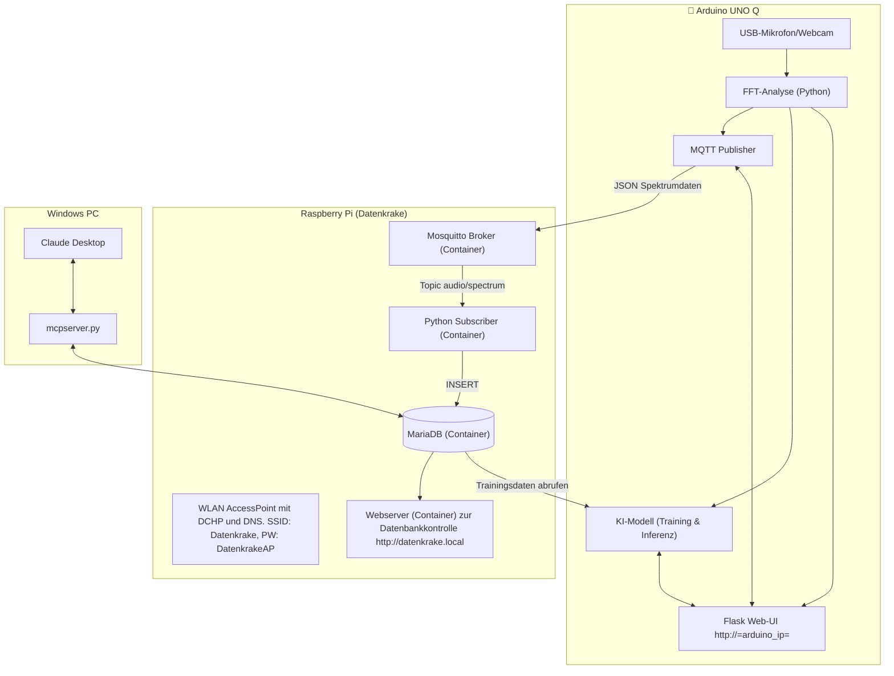
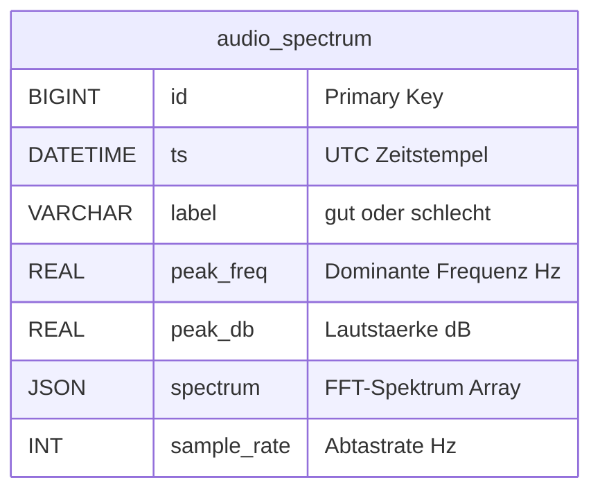
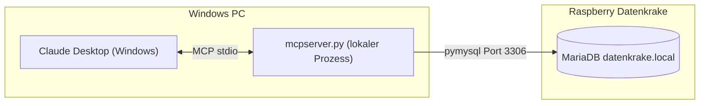

# Datenkrake - Audio-Spektrum Sammler für KI-Training

Dieses Projekt erfasst Audio-Spektrumdaten über ein USB-Mikrofon/Webcam am Arduino UNO Q und sendet sie per MQTT an den Raspberry Pi "Datenkrake". Die Daten werden in einer MariaDB-Datenbank gespeichert und können für ML-Training (Anomalieerkennung) verwendet werden.

Der Raspberry Pi arbeitet als **WLAN Access Point** ("Datenkrake") und spannt ein lokales Netzwerk ohne Internet auf.

## Benötigte Komponenten

| Komponente | Funktion |
|------------|----------|
| **PC z.B. mit Windows** | Remotezugriff per VNC (z.B. [RealVNC Viewer](https://www.realvnc.com/en/connect/download/viewer/), zum Aufrufen der Websites, MCP zum Chatten mit der Datenbank |
| **Raspberry Pi mit Netzteil und SD-Card** | Datenkrake: Access Point, MQTT-Broker, Datenbank, Dashboard, getestet mit Pi5 und Trixie |
| **einer oder mehrere Arduino UNO Q** | Audio-Erfassung, FFT-Analyse, Web-UI für Training & Inferenz |
| **je ein USB-C Netzteil, Dockingstation und USB-WebCam** | Zum Anschließen an den Arduino Uno Q|


## Netzwerk-Konfiguration

| Einstellung | Wert |
|-------------|------|
| **WLAN SSID** | Datenkrake |
| **WLAN Passwort** | DatenkrakeAP |
| **Netzwerk** | 10.0.0.0/24 |
| **Gateway (Pi)** | 10.0.0.1 |
| **DHCP-Bereich** | 10.0.0.10 - 10.0.0.254 |
| **VNC-Port** | 5900 |
| **VNC-User** | datenkrake |
| **VNC-Passwort** | datenkrake |

---

## Installation

### 1. Raspberry Pi - Docker Stack

```bash
# Repository klonen
git clone https://github.com/FlowTheTensor/Datenkrake-Container.git
cd Datenkrake-Container/Raspberry

# Docker-Stack installieren und starten
sudo ./setup_iot_stack.sh
```

Dies installiert:
- Docker & Docker Compose
- Mosquitto MQTT-Broker
- MariaDB Datenbank
- Python MQTT-Subscriber
- PHP Webserver (Dashboard)
- hostapd (Access Point)
- dnsmasq (DHCP + DNS)
- wayvnc (VNC Server für Wayland)
- Modus-Wechsel-Skript

**Hinweis:** Das Setup installiert zuerst alles was Internet benötigt (Docker, Images), danach wird der Access Point aktiviert (kappt Internet-Verbindung).

**Status prüfen:** `docker compose ps`
**Web-Interface:** `http://10.0.0.1`

### 2. Arduino UNO Q

1. USB-Mikrofon/Webcam anschließen
   - Bei Dockingstation: PD-fähig, Reihenfolge beachten (Strom → Webcam → Arduino)
2. Über Arduino App Lab `main.py` und `requirements.txt` hochladen
3. Per SSH: `nano app.yaml` → Port 80 eintragen
4. App (neu-)starten
5. Web-UI: `http://<arduino-ip>`

---

## Architekturübersicht



---

## VNC Einrichten (Fernzugriff auf Desktop)

Der Pi verwendet **wayvnc** für Wayland-kompatiblen Fernzugriff (Raspberry Pi OS Bookworm).

### VNC-Zugangsdaten

| Einstellung | Wert |
|-------------|------|
| **Adresse** | 10.0.0.1:5900 |
| **Benutzername** | datenkrake |
| **Passwort** | datenkrake |

### wayvnc manuell starten

```bash
# Falls wayvnc nicht läuft (per SSH):
wayvnc 0.0.0.0 5900 &

# Prüfen ob wayvnc läuft:
pgrep wayvnc && echo "wayvnc läuft" || echo "wayvnc nicht aktiv"
```

### Mit VNC verbinden

1. **VNC Viewer installieren**: [RealVNC Viewer](https://www.realvnc.com/de/connect/download/viewer/) oder TigerVNC
2. **Verbinden**:
   - Adresse: `10.0.0.1:5900`
   - Benutzername: `datenkrake`
   - Passwort: `datenkrake`

### VNC Troubleshooting

```bash
# Prüfen ob wayvnc läuft
pgrep wayvnc

# wayvnc manuell starten (im Kontext des Desktop-Users)
wayvnc 0.0.0.0 5900 &

# Falls nur schwarzer Bildschirm: Desktop-Session nötig
# wayvnc funktioniert nur mit laufender Wayland-Session
```

### Headless-Betrieb (kein Monitor)

Falls der Pi ohne Monitor läuft, VNC Resolution in `/boot/firmware/config.txt` setzen:

```bash
sudo nano /boot/firmware/config.txt
```

Hinzufügen:
```
hdmi_force_hotplug=1
hdmi_group=2
hdmi_mode=82
```

Danach: `sudo reboot`

---

## Modus-Wechsel (Access Point ↔ Internet)

| Modus | Beschreibung | Verwendung |
|-------|--------------|------------|
| **Access Point** | Pi erstellt WLAN "Datenkrake" | Normalbetrieb, Sensoren verbinden |
| **Client** | Pi verbindet mit externem WLAN | Updates, Pi-Connect, Git Pull |

### Über Webinterface

1. Öffne `http://10.0.0.1`
2. Tab "📡 Verbundene Geräte"
3. Modus wählen

### Per Kommandozeile

```bash
# Access Point aktivieren
sudo /opt/datenkrake/switch_mode.sh ap

# Client/Internet aktivieren
sudo /opt/datenkrake/switch_mode.sh client

# Status anzeigen
sudo /opt/datenkrake/switch_mode.sh status
```

### WLAN für Client-Modus konfigurieren

```bash
# Methode 1: raspi-config
sudo raspi-config
# → System Options → Wireless LAN

# Methode 2: Per Skript
sudo /opt/datenkrake/switch_mode.sh add "MeinWLAN" "MeinPasswort"
```

### Workflow für Updates

1. Webinterface → "Client/Internet" Modus
2. Per Pi-Connect/SSH verbinden
3. Updates holen:
   ```bash
   cd ~/Datenkrake-Container
   git pull
   cd Raspberry/compose
   docker compose up -d --build
   ```
4. Zurück zum Access Point: `sudo /opt/datenkrake/switch_mode.sh ap`

---

## Feste IP-Adressen vergeben

Trage MAC-Adressen in `/etc/dnsmasq.d/static-hosts.conf` ein:

```conf
# Format: dhcp-host=<MAC>,<IP>,<Hostname>
dhcp-host=AA:BB:CC:DD:EE:FF,10.0.0.20,arduino-sensor1
dhcp-host=11:22:33:44:55:66,10.0.0.30,laptop-lehrer
```

**IP-Bereiche:**
- `10.0.0.20-29`: Arduino/ESP-Geräte
- `10.0.0.30-39`: Lehrer-Geräte
- `10.0.0.40-69`: Schüler-Geräte
- `10.0.0.70-99`: Sonstige Geräte

Nach Änderungen: `sudo systemctl restart dnsmasq`

---

## MQTT & Datenformat

**Topic:** `audio/spectrum`

```json
{
  "label": "gut",
  "peak_freq": 1250.5,
  "peak_db": -25.3,
  "spectrum": [0.1, 0.2, ...],
  "sample_rate": 16000
}
```

---

## Troubleshooting

### Access Point startet nicht

```bash
sudo journalctl -u hostapd -f
sudo journalctl -u dnsmasq -f
ip addr show wlan0
```

### WLAN nicht sichtbar

```bash
sudo systemctl status hostapd
rfkill list
sudo rfkill unblock wifi
```

### Gerät bekommt keine IP

```bash
sudo tail -f /var/log/dnsmasq.log
sudo systemctl restart dnsmasq
```

### Container-Status

```bash
cd ~/Datenkrake-Container/Raspberry/compose
docker compose ps
docker compose logs -f
```

### Notfall-Zugang (wenn VNC nicht funktioniert)

Falls du nicht mehr auf den Pi kommst:

| Methode | Anleitung |
|---------|-----------|
| **SSH (empfohlen)** | Mit "Datenkrake" WLAN verbinden → `ssh pi@10.0.0.1` |
| **Ethernet** | Pi per LAN-Kabel an Router, IP im Router nachschauen |
| **Monitor+Tastatur** | Direkt am Pi anschließen |
| **SD-Karte** | In PC einlegen, leere Datei `ssh` (ohne Endung) in boot-Partition |

```bash
# SSH-Zugang (funktioniert auch wenn VNC nicht läuft)
ssh pi@10.0.0.1
# Passwort: dein Pi-Passwort (Standard: raspberry)
```

---

## Projektstruktur

```
Datenkrake-Container/
├── README.md                     # Diese Datei
├── ArduinoUnoQ/
│   └── Python/
│       ├── main.py               # Audio-Erfassung & Web-UI
│       └── requirements.txt
├── Raspberry/
│   ├── setup_iot_stack.sh        # Docker-Installation
│   ├── accesspoint/
│   │   ├── setup_accesspoint.sh  # AP-Installation
│   │   ├── switch_mode.sh        # Modus-Wechsel
│   │   ├── hostapd.conf          # WLAN-Konfiguration
│   │   ├── dnsmasq.conf          # DHCP/DNS-Konfiguration
│   │   └── static-hosts.conf     # Feste IP-Zuweisungen
│   ├── compose/
│   │   └── docker-compose.yml
│   ├── mosquitto/                # MQTT-Broker
│   ├── mariadb/                  # Datenbank
│   ├── subscriber/               # MQTT→DB
│   └── web/                      # Dashboard
└── MCPLokalClaudDesktop/         # MCP-Server für Claude
```
- Läuft auf `http://<arduino-ip>:80`

## MariaDB Schema

```sql
CREATE TABLE IF NOT EXISTS audio_spectrum (
    id BIGINT PRIMARY KEY AUTO_INCREMENT,
    ts DATETIME NOT NULL,
    label VARCHAR(20) NOT NULL DEFAULT 'gut',
    peak_freq REAL NOT NULL,
    peak_db REAL NOT NULL,
    spectrum JSON,
    sample_rate INT DEFAULT 16000
);
```

### ER-Modell




## Tipps
- **Services starten/stoppen**:
  ```bash
  cd compose
  docker compose up -d    # Starten
  docker compose down     # Stoppen
  docker compose ps       # Status prüfen
  ```
- **Logs anzeigen**:
  ```bash
  docker compose logs mqtt    # MQTT-Logs
  docker compose logs db      # DB-Logs
  ```
- **Datenbank verbinden**: Von einem anderen Gerät (z. B. PC im gleichen Netzwerk):
  ```bash
  mysql -h <pi-ip> -P 3306 -u sensor -p telemetry
  ```
- **MQTT testen**: Verwende einen MQTT-Client (z. B. `mosquitto_pub`):
  ```bash
  mosquitto_pub -h <pi-ip> -p 1883 -t "audio/spectrum" -m '{"label":"gut","peak_freq":1250.5,"peak_db":-25.3,"spectrum":[0.1,0.2,0.3],"sample_rate":16000}'
  ```

# Datenkrake MariaDB MCP-Server für Claude Desktop

Dieser MCP-Server (Model Context Protocol) ermöglicht Claude Desktop auf einem Windows-PC den lesenden Zugriff auf die MariaDB-Datenbank der Datenkrake (Raspberry Pi).

## Voraussetzungen

- Python 3.10+
- Claude Desktop installiert
- Raspberry Pi mit laufendem IoT-Stack (`datenkrake.local` erreichbar)
- MariaDB Port 3306 im Netzwerk erreichbar

## Installation

```powershell
pip install mcp[cli] pymysql
```

## Claude Desktop konfigurieren

Lokal ein venv anlegen und Pakete aus der requirements.txt installieren.

Datei öffnen: `%APPDATA%\Claude\claude_desktop_config.json`

```json
{
  "mcpServers": {
    "datenkrake": {
      "command": "??\\Datenkrake-Container\\MCPLokalClaudDesktop\\venv\\Scripts\\python.exe",
      "args": [
        "???\\Datenkrake-Container\\MCPLokalClaudDesktop\\mcpserver.py"
      ]
    }
  }
}
```

Pfad ggf. auf das eigene System anpassen. Danach Claude Desktop neu starten.

## Verbindungseinstellungen

Die Verbindungsdaten stehen oben in `mcpserver.py`:

| Variable | Standardwert | Beschreibung |
|----------|-------------|-------------|
| `DB_HOST` | `datenkrake.local` | Hostname des Raspberry Pi |
| `DB_PORT` | `3306` | MariaDB-Port |
| `DB_USER` | `mcp_read` | Nur-Lese-Benutzer |
| `DB_PASSWORD` | `changeMeMcp` | Passwort (bitte ändern!) |
| `DB_NAME` | `telemetry` | Datenbankname |

Der `mcp_read`-User wird automatisch beim ersten Start des IoT-Stacks durch das Init-Skript angelegt (`mariadb/init/00-create-database.sql`).

## Verfügbare Tools

| Tool | Parameter | Beschreibung |
|------|-----------|-------------|
| `get_recent` | `limit` (Standard: 20) | Letzte N Einträge (ohne Spektrum-Array) |
| `get_stats` | – | Statistiken pro Label: Anzahl, Ø Frequenz, Ø Lautstärke, Zeitraum |
| `get_spectrum` | `record_id` | Vollständiger Datensatz inkl. FFT-Array für eine ID |
| `get_table_info` | – | Tabellenstruktur von `audio_spectrum` |
| `query` | `sql` | Freie SELECT/SHOW/DESCRIBE-Abfrage (kein Schreiben möglich) |

## Beispieldialoge mit Claude

> „Zeig mir die letzten 10 Messungen"  
> → Claude ruft `get_recent(limit=10)` auf

> „Wie viele 'gut'- und 'schlecht'-Aufnahmen gibt es?"  
> → Claude ruft `get_stats()` auf

> „Was ist die durchschnittliche Peakfrequenz bei schlechten Aufnahmen?"  
> → Claude nutzt `query()` mit einer passenden SQL-Abfrage

## Architektur



## Troubleshooting

| Problem | Lösung |
|---------|--------|
| `Can't connect to MySQL server` | Pi erreichbar? `ping datenkrake.local` testen |
| `Access denied for user mcp_read` | Passwort in `mcpserver.py` und DB prüfen |
| MCP-Server erscheint nicht in Claude | `claude_desktop_config.json` Syntax prüfen; Claude neu starten |
| `ModuleNotFoundError: mcp` | `pip install mcp[cli]` ausführen |


## Nächste Schritte
- Anomalie-Modell mit gesammelten Spektrumdaten trainieren
- Echtzeit-Inferenz auf Arduino implementieren
- Alarm-System bei erkannten Anomalien
